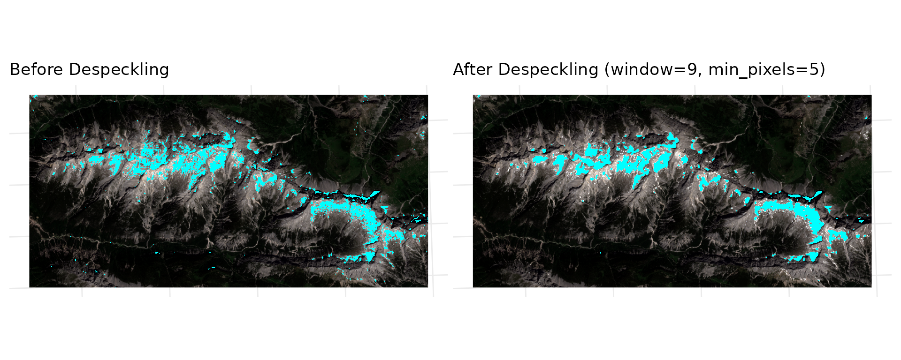
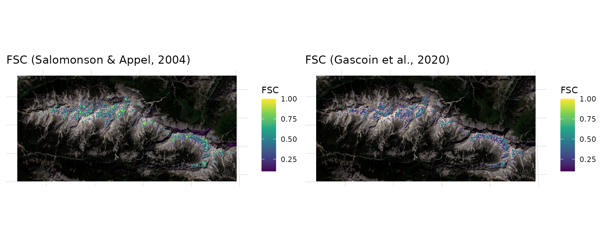

# Snow Detection and Fractional Snow Cover with snowsense

This vignette demonstrates a full snow analysis workflow using a
Sentinel-2 L1C scene (Stacked to a single tif, resampled to 20m) from
the Austrian Alps (June 2023). The corresponding Github Repository can
be found [here](https://github.com/Lutzkk/snowsense), which also
contains the dataset shown here. The code for the plots is left out in
this vignette.

The workflow includes:

1.  Data Loading
2.  Snow Detection
3.  Despeckling
4.  Fractional Snow Cover Estimation using two different regression
    approaches

``` r
library(terra)
#> terra 1.9.11
library(tidyterra)
#> 
#> Attaching package: 'tidyterra'
#> The following object is masked from 'package:stats':
#> 
#>     filter
library(ggplot2)
library(snowsense)
library(patchwork)
#> 
#> Attaching package: 'patchwork'
#> The following object is masked from 'package:terra':
#> 
#>     area
```

## Data Loading

The example dataset is a clipped Sentinel-2 L1C scene (dtype:
**uint16**, bands: **B01 - B12**) which has been stacked to a single
multi-band GeoTIFF and resampled to 20m resolution.

``` r
# Load Packages 
library(snowsense)

ds <- rast("../inst/extdata/example_s2_20m.tif") #load sentinel2 data as SpatRaster with terra
ds <- ds / 10000 #scale to reflectance values (0-1)

print(paste("Bands available:", paste(names(ds), collapse = ", ")))
#> [1] "Bands available: B01, B02, B03, B04, B05, B06, B07, B08, B8A, B09, B10, B11, B12"

plotRGB(ds, r="B04", g="B03", b="B02", stretch="lin", main="Sentinel-2 L1C RGB Scene (20m, Stacked)") 
```


## Snow Detection

`snowsense` supports three spectral indices for snow detection
(**NDSI**, **RGB_brightness**, and
**[WSI](https://doi.org/10.1007/s00703-020-00749-y)**). NDSI is
demonstrated here as it suits the Sentinel-2 data best. An approach with
a fixed threshold (0.4) and an unsupervised approach using [Otsu’s
method](https://doi.org/10.1109/TSMC.1979.4310076) are shown for
comparison.

``` r
result_ndsi <- detect_snow(ds, index = "ndsi",
                           bands = list(green = "B03", swir = "B11"),
                           threshold = 0.4)

# Note that if no threshold is set, the function falls back to Otsu's method. An unsupervised
# approach that selects an optimal threshold for separating bimodal grayscale data into two classes
result_ndsi_otsu <- detect_snow(ds, index = "ndsi",
                                bands = list(green = "B03", swir = "B11"),
                                threshold = NULL)
#> Warning: [hist] a sample of 70% of the cells was used
```

    #> <SpatRaster> resampled to 500364 cells.
    #> <SpatRaster> resampled to 500364 cells.
    #> <SpatRaster> resampled to 500364 cells.
    #> <SpatRaster> resampled to 500364 cells.

 The bottom
right plot depicts the snow mask derived from using Otsu’s method for
thresholding. The automatically selected lower threshold here works
better, capturing more snow pixels and reducing false negatives from the
fixed threshold (from a visual inspection). However, with a fixed
threshold you have full control and reproducibility across scenes.
RGB_brightness is especially useful for high resolution drone data,
where only RGB is available. WSI is based on a paper from Donmez et
al. (2021) and is especially good at discriminating between water and
snow.

## Despeckling

Snow masks often contain speckle noise (isolated snow classified pixels
that may be noise or small patches that can be caused by
misclassification). [`despeckle_snow()`](../reference/despeckle_snow.md)
removes these using majority filtering and/or a minimum patch size
filter.

``` r
clean <- despeckle_snow(result_ndsi_otsu$binary_mask,
                        window=9, min_pixels=5)
```

    #> <SpatRaster> resampled to 500364 cells.
    #> <SpatRaster> resampled to 500364 cells.

 The
despeckling function removes small isolated snow pixels that are likely
false positives. The parameters `window` and `min_pixels` control the
size of the neighborhood (majority based filtering) and the minimum
number of connected pixels required to retain a snow patch (size based
filtering). The plot shows that after despeckling a lot of tiny blue
dots have been removed, indicating it is an effective way to clean up
the snow mask from tiny positives. However, it also removes some small
snow patches that may be real, so there is a tradeoff between removing
noise and losing small features.

## Fractional Snow Cover Estimation

Rather than a binary snow mask,
[`snow_cover_fraction()`](../reference/snow_cover_fraction.md) estimates
the fraction of snow cover per pixel directly using NDSI-based
regression. This is useful when sub-pixel snow cover information is
needed, for example at coarser resolutions.

Two regression approaches are currently supported in the package: -
**[Salomonson & Appel
(2004)](https://doi.org/10.1016/j.rse.2003.10.016)**: FSC = 0.06 + 1.21
\* NDSI - **[Gascoin et
al. (2020)](https://doi.org/10.3390/rs12182904)**: FSC = 0.5 \*
tanh(2.65 \* NDSI - 1.42) + 0.5

``` r
#salomonson
fsc_sal <- snow_cover_fraction(ds, bands = list(green = "B03", swir = "B11"),
                               method = "salomonson")
#gascoin
fsc_sig <- snow_cover_fraction(ds, bands = list(green = "B03", swir = "B11"),
                               method = "sigmoid")
```

    #> <SpatRaster> resampled to 500364 cells.
    #> <SpatRaster> resampled to 500364 cells.


