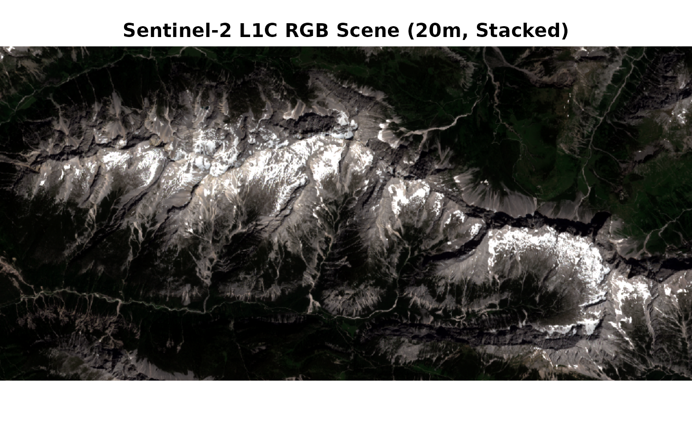
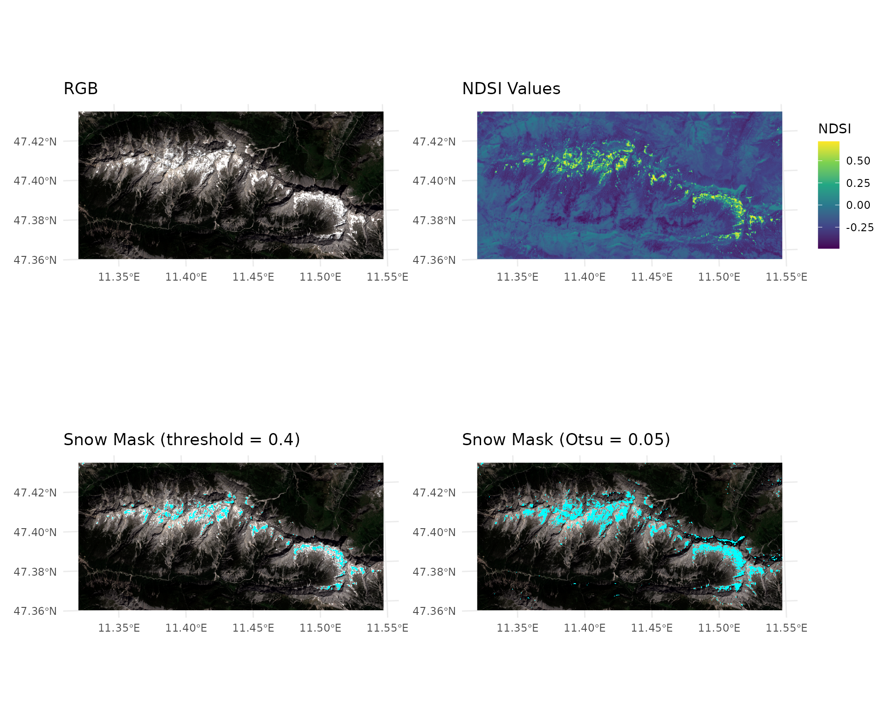

# Snow Detection and Fractional Snow Cover with snowsense

``` r
library(terra)
#> terra 1.9.11
library(tidyterra)
#> 
#> Attaching package: 'tidyterra'
#> The following object is masked from 'package:stats':
#> 
#>     filter
library(ggplot2)
library(snowsense)
library(patchwork)
#> 
#> Attaching package: 'patchwork'
#> The following object is masked from 'package:terra':
#> 
#>     area
```

## This vignette demonstrates a full snow analysis workflow using a Sentinel-2 L1C scene (Stacked to a single tif, resampled to 20m) from the Austrian Alps (June 2023).

The workflow includes: 1. Data Loading 2. Snow Detection using different
indices 3. Despeckling 4. Fractional Snow Cover Estimation using two
different regression approaches

``` r
# Load Packages 
library(snowsense)

ds <- rast("../inst/extdata/example_s2_20m.tif") #load sentinel2 data as SpatRaster with terra

print(paste("Bands available:", paste(names(ds), collapse = ", ")))
#> [1] "Bands available: B01, B02, B03, B04, B05, B06, B07, B08, B8A, B09, B10, B11, B12"

plotRGB(ds, r="B04", g="B03", b="B02", stretch="lin", main="Sentinel-2 L1C RGB Scene (20m, Stacked)") #lin2
```

 \## Snow
Detection `snowsense` supports three spectral indices for snow
detection. We apply all three to the same scene for comparison. To
understand the how the indices work, its best to consult the README and
the original papers.

``` r
result_ndsi <- detect_snow(ds, index = "ndsi",
                             bands = list(green = "B03", swir = "B11"),
                             threshold = 0.4)

# Note that if no threshold is set, the function falls back to Otsu's method. An unsupervised
# approach that selects an optimal threshold for separating bimodal grayscale data into two classes
result_ndsi_otsu <- detect_snow(ds, index = "ndsi",
                                bands = list(green = "B03", swir = "B11"),
                                threshold = NULL)
#> Warning: [hist] a sample of 70% of the cells was used
```

    #> <SpatRaster> resampled to 500364 cells.
    #> <SpatRaster> resampled to 500364 cells.
    #> <SpatRaster> resampled to 500364 cells.
    #> <SpatRaster> resampled to 500364 cells.



``` r
library(terra)
x <- rast("../inst/extdata/example_s2_20m.tif")
x <- x / 10000
writeRaster(x, "../inst/extdata/example_s2_20m.tif", overwrite = TRUE)
```

\#Plot The second plot showcases that although Otsus method can work, it
does not produce as precise results as
